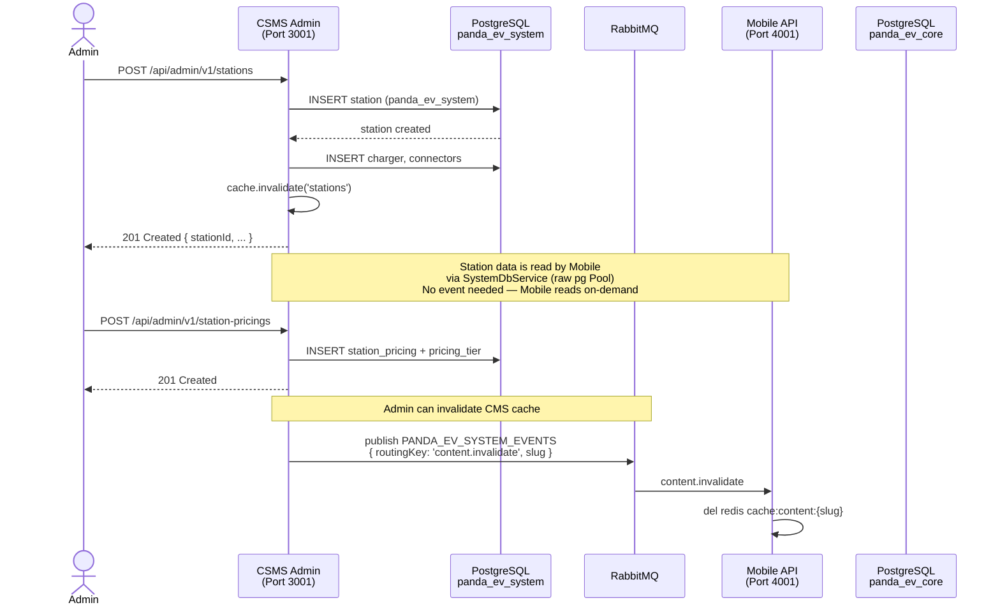
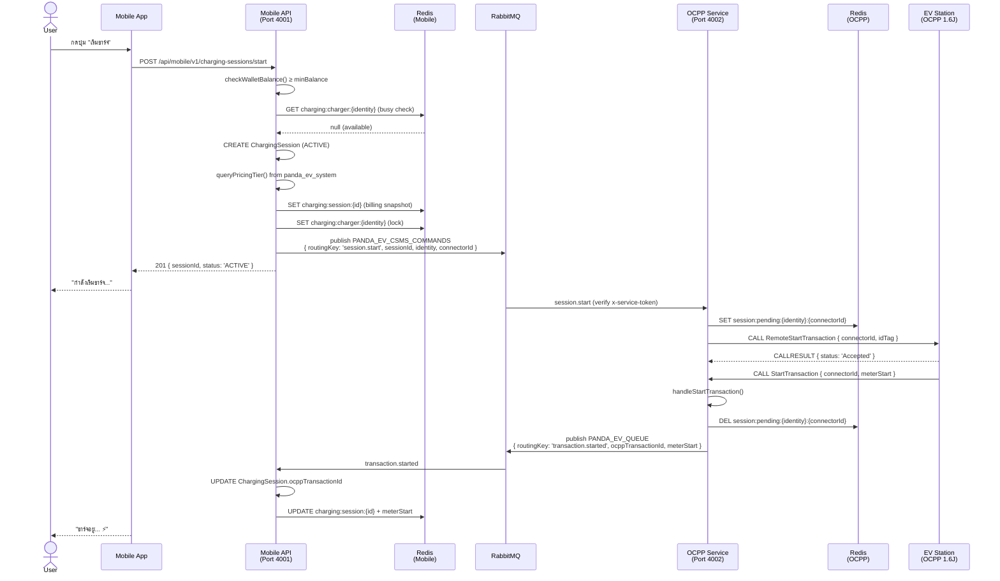
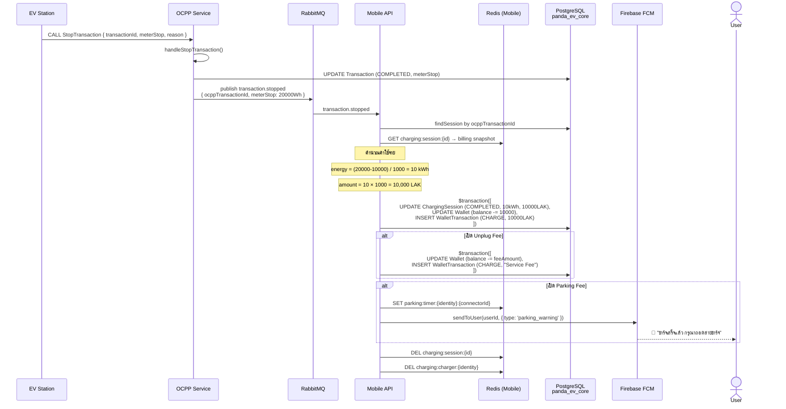
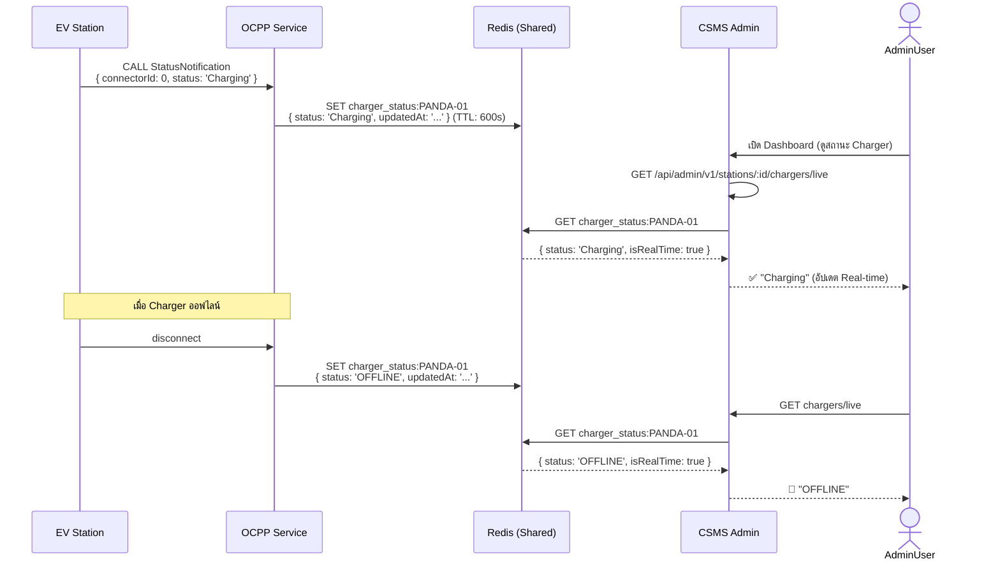
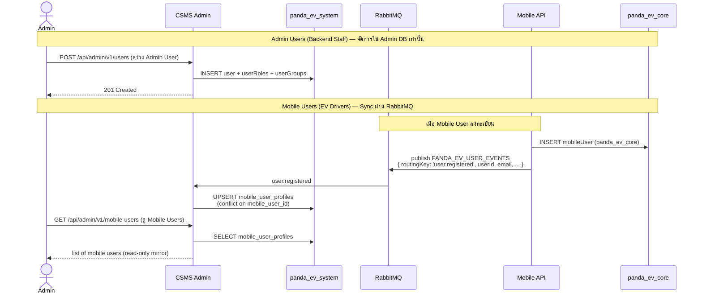
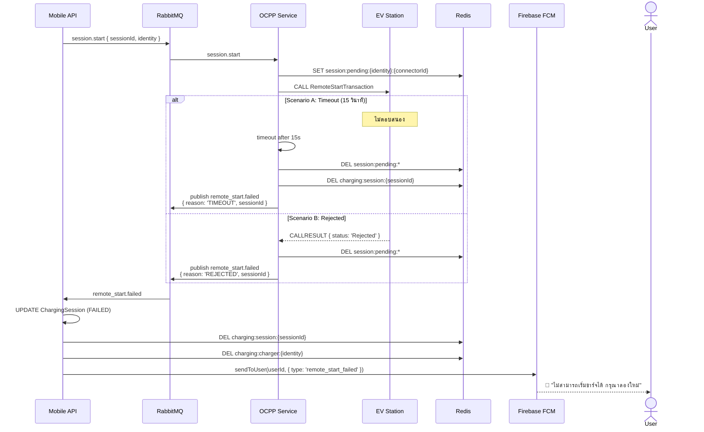

# เอกสารสถาปัตยกรรมระบบบริหารจัดการการชาร์จรถยนต์ไฟฟ้า (EV Charging Management System)

> **Panda EV Platform** — วิเคราะห์สถาปัตยกรรม 3 Microservices
> จัดทำโดย: Claude Code Analysis
> วันที่: 2026-03-22

---

## สารบัญ

1. [ภาพรวมสถาปัตยกรรมระบบ](#1-ภาพรวมสถาปัตยกรรมระบบ)
2. [REST API Specification](#2-rest-api-specification)
3. [RabbitMQ Message Queue Architecture](#3-rabbitmq-message-queue-architecture)
4. [WebSocket Communication](#4-websocket-communication)
5. [Data Flow Scenarios](#5-data-flow-scenarios)
6. [Security Implementation](#6-security-implementation)
7. [Performance Optimization](#7-performance-optimization)
8. [Implementation Checklist](#8-implementation-checklist)
9. [OCPP Action Gap Analysis](#9-ocpp-action-gap-analysis)
10. [Deployment บน Google Cloud](#10-deployment-บน-google-cloud)

---

## 1. ภาพรวมสถาปัตยกรรมระบบ

### 1.1 Mermaid Diagram — ภาพรวม

```mermaid
graph TB
    subgraph External["🌐 External Clients"]
        WEB["🖥️ Admin Browser\n(React/Vue Dashboard)"]
        MOB["📱 Mobile App\n(iOS / Android)"]
        EV["⚡ EV Charging Station\n(OCPP 1.6J over WebSocket)"]
    end

    subgraph ADMIN["🏢 CSMS Admin Service (Port 3001)\npanda-ev-csms-system-admin"]
        A_REST["REST API\n/api/admin/v1/..."]
        A_WS["Socket.IO Gateway\n/pricing, / (notifications)"]
        A_RMQ["RabbitMQ Consumer\nPANDA_EV_USER_EVENTS\nmessage.created"]
        A_DB[("PostgreSQL\npanda_ev_system\n29 Models")]
        A_CACHE[("Redis\nCache + Sessions")]
    end

    subgraph OCPP["⚡ OCPP Service (Port 4002)\npanda-ev-ocpp"]
        O_WS["WebSocket Gateway\nws://host/ocpp/{identity}\nOCPP 1.6J Protocol"]
        O_REST["Internal Services\n(No REST endpoints)"]
        O_RMQ_PUB["RabbitMQ Publisher\nPANDA_EV_QUEUE"]
        O_RMQ_SUB["RabbitMQ Consumer\nPANDA_EV_CSMS_COMMANDS"]
        O_DB[("PostgreSQL\npanda_ev_ocpp\n4 Models")]
        O_CACHE[("Redis\nCharger Status\nSession State")]
    end

    subgraph MOBILE["📱 Mobile API Service (Port 4001)\npanda-ev-client-mobile"]
        M_REST["REST API\n/api/mobile/v1/..."]
        M_RMQ_PUB["RabbitMQ Publisher\nPANDA_EV_CSMS_COMMANDS\nPANDA_EV_USER_EVENTS"]
        M_RMQ_SUB["RabbitMQ Consumer\nPANDA_EV_QUEUE\nPANDA_EV_SYSTEM_EVENTS"]
        M_DB[("PostgreSQL\npanda_ev_core\n13 Models")]
        M_CACHE[("Redis\nBilling Snapshot\nCharger Lock\nParking Timer")]
        M_SYSDB[("SystemDbService\nRead from\npanda_ev_system")]
    end

    subgraph INFRA["🛠️ Shared Infrastructure"]
        MQ[("🐰 RabbitMQ\nMessage Broker")]
        REDIS[("🔴 Redis\nShared Cache\ncharger_status:{id}")]
        FCM["🔔 Firebase FCM\nPush Notifications"]
    end

    %% Admin connections
    WEB -->|HTTPS REST| A_REST
    WEB -->|Socket.IO| A_WS
    A_REST --- A_DB
    A_REST --- A_CACHE
    A_WS --- A_CACHE
    A_RMQ --- A_DB

    %% Mobile connections
    MOB -->|HTTPS REST + JWT| M_REST
    M_REST --- M_DB
    M_REST --- M_CACHE
    M_REST --- M_SYSDB
    M_REST -->|FCM Push| FCM
    FCM -->|Push| MOB

    %% OCPP connections
    EV <-->|WebSocket OCPP 1.6J| O_WS
    O_WS --- O_DB
    O_WS --- O_CACHE

    %% RabbitMQ flows
    M_RMQ_PUB -->|session.start\nsession.stop| MQ
    MQ -->|PANDA_EV_CSMS_COMMANDS| O_RMQ_SUB
    O_RMQ_PUB -->|transaction.started\ntransaction.stopped\ncharger.booted\netc.| MQ
    MQ -->|PANDA_EV_QUEUE| M_RMQ_SUB
    M_RMQ_PUB -->|user.registered| MQ
    MQ -->|PANDA_EV_USER_EVENTS| A_RMQ
    A_REST -->|content.invalidate| MQ
    MQ -->|PANDA_EV_SYSTEM_EVENTS| M_RMQ_SUB

    %% Redis shared
    O_CACHE -->|charger_status:{identity}| REDIS
    REDIS -->|read live status| A_CACHE

    %% Admin reads Mobile DB
    M_SYSDB -->|raw pg Pool\nread-only| A_DB

    classDef admin fill:#4A90D9,color:#fff,stroke:#2171B5
    classDef ocpp fill:#27AE60,color:#fff,stroke:#1E8449
    classDef mobile fill:#8E44AD,color:#fff,stroke:#6C3483
    classDef infra fill:#E67E22,color:#fff,stroke:#D35400
    classDef external fill:#ECF0F1,color:#2C3E50,stroke:#BDC3C7
    class ADMIN admin
    class OCPP ocpp
    class MOBILE mobile
    class INFRA infra
    class External external
```

### 1.2 Legend — คำอธิบายสัญลักษณ์

| สัญลักษณ์ | ประเภทการสื่อสาร | ลักษณะ |
|---|---|---|
| `─────►` HTTPS REST | Synchronous | Client ส่ง request รอ response ทันที |
| `─ ─ ─►` RabbitMQ | Asynchronous | Publish แล้วไม่รอ, Consumer ประมวลผลแยก |
| `◄────►` WebSocket | Bidirectional Real-time | เชื่อมต่อถาวร ส่งทั้งสองทาง |
| `━━━━►` Redis Shared | Cache/Pub-Sub | Service A เขียน, Service B อ่าน |
| `· · · ►` Raw pg Pool | Cross-DB Read | Mobile อ่านข้อมูล Admin DB โดยตรง |

---

## 2. REST API Specification

> **หมายเหตุ:** ใน Architecture ปัจจุบัน Service ไม่ได้เรียก REST API หากันโดยตรง
> การสื่อสารระหว่าง Service ใช้ **RabbitMQ** (async) และ **Redis** (shared state)
> Mobile อ่านข้อมูล Admin ผ่าน **SystemDbService** (raw PostgreSQL pool)

### 2.1 CSMS Admin → OCPP (ไม่มี REST — ใช้ Redis + ไม่มีการเรียกโดยตรง)

| เส้นทาง | วิธี | บริการต้นทาง | บริการปลายทาง | วัตถุประสงค์ | หมายเหตุ |
|---|---|---|---|---|---|
| *ไม่มี* | — | Admin | OCPP | Admin ไม่เรียก OCPP โดยตรง | ใช้ Redis `charger_status:*` แทน |

**สิ่งที่ Admin อ่านจาก OCPP ผ่าน Redis:**

```typescript
// GET /api/admin/v1/stations/:id/chargers/live
// charger-live-status.service.ts:getChargerLiveStatus()

const liveStatus = await redis.get(`charger_status:${ocppIdentity}`);
// Returns: { status, identity, updatedAt } | null
```

### 2.2 CSMS Admin → Mobile (ผ่าน RabbitMQ, ไม่ใช่ REST)

| Queue | Routing Key | ต้นทาง | ปลายทาง | วัตถุประสงค์ |
|---|---|---|---|---|
| `PANDA_EV_SYSTEM_EVENTS` | `content.invalidate` | Admin | Mobile | ล้าง Cache CMS เมื่อแก้ไข Banner/Legal |

### 2.3 Mobile → OCPP (ผ่าน RabbitMQ, ไม่ใช่ REST)

| Queue | Routing Key | ต้นทาง | ปลายทาง | วัตถุประสงค์ |
|---|---|---|---|---|
| `PANDA_EV_CSMS_COMMANDS` | `session.start` | Mobile | OCPP | เริ่ม Charging Session |
| `PANDA_EV_CSMS_COMMANDS` | `session.stop` | Mobile | OCPP | หยุด Charging Session |

### 2.4 REST API สำหรับ Client (External)

#### Admin REST API (`/api/admin/v1/`)

| Method | Endpoint | วัตถุประสงค์ | Auth |
|---|---|---|---|
| `POST` | `/auth/login` | เข้าสู่ระบบ | Public |
| `GET` | `/stations` | รายการสถานี | Bearer + `stations:read` |
| `POST` | `/stations` | สร้างสถานี | Bearer + `stations:create` |
| `GET` | `/stations/:id/chargers/live` | สถานะ Charger Real-time | Bearer + `chargers:read` |
| `GET` | `/users` | รายการ Admin Users | Bearer + `users:read` |
| `POST` | `/users` | สร้าง Admin User | Bearer + `users:create` |
| `GET` | `/pricing-tiers` | รายการ Pricing Tier | Bearer + `pricing-tiers:read` |
| `GET` | `/iam/roles` | รายการ Role | Bearer + `roles:read` |
| `GET` | `/audit-logs` | ประวัติการดำเนินการ | Bearer + `audit-logs:read` |

#### Mobile REST API (`/api/mobile/v1/`)

| Method | Endpoint | วัตถุประสงค์ | Auth |
|---|---|---|---|
| `POST` | `/auth/register` | สมัครสมาชิก | Public |
| `POST` | `/auth/verify-otp` | ยืนยัน OTP | Public |
| `POST` | `/auth/login` | เข้าสู่ระบบ | Public |
| `GET` | `/stations` | รายการสถานีชาร์จ | Bearer |
| `GET` | `/stations/nearby` | สถานีใกล้เคียง | Bearer |
| `GET` | `/wallet` | ยอดกระเป๋าเงิน | Bearer |
| `POST` | `/wallet/top-up` | เติมเงิน | Bearer |
| `POST` | `/charging-sessions/start` | เริ่มชาร์จ | Bearer |
| `POST` | `/charging-sessions/:id/stop` | หยุดชาร์จ | Bearer |
| `GET` | `/charging-sessions` | ประวัติการชาร์จ | Bearer |

### 2.5 Response Format มาตรฐาน (ทุก Service)

```json
{
  "success": true,
  "statusCode": 200,
  "data": { "...": "..." },
  "message": "Operation successful",
  "meta": {
    "page": 1,
    "limit": 20,
    "total": 150,
    "totalPages": 8
  },
  "timestamp": "2026-03-22T08:00:00+07:00"
}
```

---

## 3. RabbitMQ Message Queue Architecture

### 3.1 Exchange และ Queue Design

| Queue Name | ผู้ส่ง | ผู้รับ | วัตถุประสงค์ | Security |
|---|---|---|---|---|
| `PANDA_EV_QUEUE` | OCPP | Mobile | OCPP Events → Mobile Billing/FCM | RS256 JWT |
| `PANDA_EV_CSMS_COMMANDS` | Mobile | OCPP | Session Commands → Charger | RS256 JWT |
| `PANDA_EV_USER_EVENTS` | Mobile | Admin | User Registration Sync | RS256 JWT |
| `PANDA_EV_SYSTEM_EVENTS` | Admin | Mobile | CMS Content Invalidation | RS256 JWT |
| `message.created` | Chat Service | Admin | Push Notification Trigger | RS256 JWT |

### 3.2 Message Payload Examples

#### `PANDA_EV_CSMS_COMMANDS` — session.start

```json
{
  "routingKey": "session.start",
  "sessionId": "sess-uuid-0001",
  "identity": "PANDA-THATLUANG-01",
  "connectorId": 1,
  "mobileUserId": "user-uuid-0001",
  "idTag": "RFID-TAG-001"
}
```

#### `PANDA_EV_CSMS_COMMANDS` — session.stop

```json
{
  "routingKey": "session.stop",
  "identity": "PANDA-THATLUANG-01",
  "transactionId": 42
}
```

#### `PANDA_EV_QUEUE` — transaction.started

```json
{
  "routingKey": "transaction.started",
  "sessionId": "sess-uuid-0001",
  "ocppTransactionId": 42,
  "meterStart": 10000,
  "startTime": "2026-03-22T08:00:00+07:00",
  "identity": "PANDA-THATLUANG-01",
  "chargerId": "charger-uuid-0001",
  "connectorId": 1,
  "mobileUserId": "user-uuid-0001"
}
```

#### `PANDA_EV_QUEUE` — transaction.stopped

```json
{
  "routingKey": "transaction.stopped",
  "ocppTransactionId": 42,
  "meterStop": 20000,
  "stopReason": "Remote",
  "stopTime": "2026-03-22T09:30:00+07:00",
  "identity": "PANDA-THATLUANG-01",
  "chargerId": "charger-uuid-0001"
}
```

#### `PANDA_EV_QUEUE` — remote_start.failed

```json
{
  "routingKey": "remote_start.failed",
  "sessionId": "sess-uuid-0001",
  "identity": "PANDA-THATLUANG-01",
  "connectorId": 1,
  "mobileUserId": "user-uuid-0001",
  "reason": "TIMEOUT",
  "failedAt": "2026-03-22T08:00:15+07:00"
}
```

#### `PANDA_EV_QUEUE` — connector.status_changed

```json
{
  "routingKey": "connector.status_changed",
  "identity": "PANDA-THATLUANG-01",
  "chargerId": "charger-uuid-0001",
  "connectorId": 1,
  "status": "Available",
  "updatedAt": "2026-03-22T09:35:00+07:00"
}
```

#### `PANDA_EV_USER_EVENTS` — user.registered

```json
{
  "routingKey": "user.registered",
  "userId": "mobile-user-uuid-0001",
  "email": "user@example.com",
  "firstName": "ສົມ",
  "lastName": "ໃຈດີ",
  "phoneNumber": "+8562012345678",
  "registeredAt": "2026-03-22T08:00:00+07:00"
}
```

#### `PANDA_EV_SYSTEM_EVENTS` — content.invalidate

```json
{
  "routingKey": "content.invalidate",
  "slug": "home-banner"
}
```

### 3.3 Service-to-Service JWT Header

ทุก RabbitMQ message จะมี AMQP Header:

```
x-service-token: eyJhbGciOiJSUzI1NiIsInR5cCI6IkpXVCJ9...
```

```json
{
  "iss": "mobile-api",
  "aud": "PANDA_EV_CSMS_COMMANDS",
  "jti": "unique-token-id",
  "iat": 1742624400,
  "exp": 1742624430
}
```

ถ้า Token ไม่ผ่านการตรวจสอบ → **nack ทิ้ง** (ไม่ requeue)

### 3.4 Error Handling และ Retry Strategy

```
Publisher ─────► RabbitMQ Queue ─────► Consumer
                                            │
                               ┌───────────┤
                               │           ▼
                          Error?      ackOrNack()
                               │
                    ┌──────────┴──────────┐
                    │                     │
              Nack (no requeue)     Throw Error
              (invalid JWT,         (DB failure)
               bad payload)          → RabbitMQ
                                     requeues 1x
                                     then DLQ
```

**กลยุทธ์:**
- `nack` ไม่มี requeue → ข้อความที่ Token ผิดหรือ Payload ไม่ถูกต้อง
- `throw` error → RabbitMQ requeue อัตโนมัติ (1 ครั้ง) แล้ว Dead Letter Queue
- ควรเพิ่ม DLQ (`PANDA_EV_DLQ`) เพื่อ Monitor ข้อความที่ล้มเหลว

---

## 4. WebSocket Communication

### 4.1 Connection Management

#### OCPP Gateway (Port 4002)

```
wss://host/ocpp/{chargeBoxIdentity}
Subprotocol: ocpp1.6
```

| Event | Handler | ผล |
|---|---|---|
| `connection` | `handleConnection()` | ตรวจสอบ subprotocol, เก็บ socket ใน Map |
| `message` | `handleCall()` | Route ไปยัง handler ตาม action |
| `disconnect` | `handleDisconnection()` | Set status OFFLINE, ล้าง Redis |

#### Admin Socket.IO (Port 3001)

| Namespace | Room | วัตถุประสงค์ |
|---|---|---|
| `/` (default) | `user:{userId}` | Push notifications ถึง Admin |
| `/pricing` | `station:{stationId}` | Real-time pricing updates |

#### Mobile WebSocket

> Mobile ไม่มี WebSocket Gateway โดยตรง
> ใช้ **REST Polling** + **FCM Push Notification** แทน

### 4.2 OCPP Action Event Table

| Action | ทิศทาง | Handler | ผล DB | ผล Redis | RabbitMQ |
|---|---|---|---|---|---|
| `BootNotification` | Station→OCPP | `handleBootNotification()` | Charger.status=ONLINE | `charger_status:{id}` | `charger.booted` |
| `StatusNotification` (id=0) | Station→OCPP | `handleStatusNotification()` | Charger.status | `charger_status:{id}` | `charger.status_changed` |
| `StatusNotification` (id>0) | Station→OCPP | `handleStatusNotification()` | Connector.status | `connector_status:{id}:{conn}` | `connector.status_changed` |
| `Heartbeat` | Station→OCPP | `handleHeartbeat()` | Charger.lastHeartbeat | — | `charger.heartbeat` |
| `StartTransaction` | Station→OCPP | `handleStartTransaction()` | Transaction(ACTIVE) | del `session:pending:*` | `transaction.started` |
| `StopTransaction` | Station→OCPP | `handleStopTransaction()` | Transaction(COMPLETED) | — | `transaction.stopped` |
| `MeterValues` | Station→OCPP | `handleMeterValues()` | — | `charging:live:{id}:{conn}` | — |
| `RemoteStartTransaction` | OCPP→Station | `sendRemoteStart()` | — | `session:pending:*` | `remote_start.failed` (ถ้าล้มเหลว) |
| `RemoteStopTransaction` | OCPP→Station | `sendRemoteStop()` | — | — | — |
| Disconnect | — | `handleDisconnection()` | — | `charger_status:{id}=OFFLINE` | `charger.offline` |

### 4.3 Redis Key Reference (ทั้ง 3 Service)

| Key Pattern | TTL | ผู้เขียน | ผู้อ่าน | วัตถุประสงค์ |
|---|---|---|---|---|
| `charger_status:{identity}` | 600s | OCPP | Admin | Charger status สำหรับ Dashboard |
| `connector_status:{chargerId}:{connectorId}` | 60s | OCPP | OCPP | Connector status cache |
| `session:pending:{identity}:{connectorId}` | 300s | OCPP SessionService | OCPP handleStartTransaction | เชื่อม Mobile session กับ OCPP transaction |
| `charging:live:{identity}:{connectorId}` | 8h | OCPP | — | Live meter readings (Wh) |
| `charger:apikey:{identity}` | — | Admin | OCPP | Auth API key สำหรับ Charger |
| `charging:session:{sessionId}` | 8h | Mobile | Mobile OcppConsumer | Billing snapshot |
| `charging:charger:{identity}` | 8h | Mobile | Mobile | Lock ป้องกัน double-start |
| `parking:timer:{identity}:{connectorId}` | 8h | Mobile | Mobile | Parking fee timer |
| `refresh:{userId}:{tokenId}` | 7d | Admin/Mobile | Admin/Mobile | Refresh token tracking |
| `svc:jti:{jti}` | 60s | ServiceJwtService | ServiceJwtService | Anti-replay blacklist |
| `cache:{resource}:{md5(params)}` | Varies | All Services | All Services | Query result cache |

---

## 5. Data Flow Scenarios

### 5.1 Scenario 1: Admin สร้างสถานีชาร์จใหม่



### 5.2 Scenario 2: User เริ่มชาร์จ (Full Flow)



### 5.3 Scenario 3: ชาร์จเสร็จและคิดค่าบริการ



### 5.4 Scenario 4: Real-time Status ไปยัง Admin Dashboard



### 5.5 Scenario 5: Admin จัดการ User Account



### 5.6 Scenario 6: Remote Start ล้มเหลว (Timeout/Rejected)



---

## 6. Security Implementation

### 6.1 Service-to-Service JWT (RS256)

```typescript
// ServiceJwtService — ทุก Service ใช้ร่วมกัน
// src/common/service-auth/service-jwt.service.ts

class ServiceJwtService {
  // ลงนาม token 30 วินาที ก่อน publish RabbitMQ
  sign(audience: string): string | null {
    // RS256 private key → JWT
    // payload: { iss, aud, jti, iat, exp: +30s }
  }

  // ตรวจสอบ token ขาเข้า
  async verify(token: string): Promise<Payload | null> {
    // 1. Parse header.payload.signature
    // 2. ตรวจสอบ iss มีใน trustedKeys
    // 3. ตรวจสอบ signature ด้วย RSA public key
    // 4. ตรวจสอบ exp (ไม่เกิน 30 วินาที)
    // 5. ตรวจสอบ jti ใน Redis blacklist (ป้องกัน replay attack)
    // 6. บันทึก jti ลง Redis (TTL 60s)
  }
}
```

**Trust Matrix:**

| Service | ออก Token เป็น | เชื่อ Token จาก |
|---|---|---|
| `admin-api` | `admin-api` | `mobile-api`, `ocpp-csms` |
| `mobile-api` | `mobile-api` | `admin-api`, `ocpp-csms` |
| `ocpp-csms` | `ocpp-csms` | `mobile-api`, `admin-api` |

### 6.2 User JWT Authentication

```
Admin Service:
  - RS256 (JWT_PRIVATE_KEY + JWT_PUBLIC_KEY) หรือ HS256 fallback (JWT_SECRET)
  - Access Token: 15 นาที
  - Refresh Token: 7 วัน (เก็บใน Redis refresh:{userId}:{tokenId})

Mobile Service:
  - RS256 หรือ HS256 fallback
  - Access Token: 15 นาที
  - Refresh Token: 30 วัน
```

### 6.3 RBAC (Role-Based Access Control) — Admin Service

```
Permission format: {resource}:{action}
ตัวอย่าง: stations:read, users:create, pricing-tiers:update

Roles:
  super-admin  → ทุก Permission (90)
  admin        → 80 Permission (ยกเว้น roles:*, permissions:*)
  viewer       → 18 Permission (read-only เท่านั้น)

การตรวจสอบ:
  ทุก request → JwtStrategy.validate() → โหลด permissions จาก DB
  (ไม่เก็บใน JWT → revoke ทันทีเมื่อเปลี่ยน Role)
```

### 6.4 API Key สำหรับ Charger Authentication

```
Redis Key: charger:apikey:{ocppIdentity}
ตั้งค่าผ่าน Admin Panel
OCPP Gateway อ่านเมื่อ OCPP_AUTH_ENABLED=true

การตรวจสอบ:
  HTTP Upgrade request → extractBasicAuth(headers)
  → redis.get(charger:apikey:{identity})
  → เปรียบเทียบ
  → ปฏิเสธถ้าไม่ตรง
```

### 6.5 Soft Delete

```typescript
// ทุก Service — ไม่ลบข้อมูลจริง
await prisma.resource.update({
  where: { id },
  data: { deletedAt: new Date(), updatedById: userId }
});

// ทุก query กรอง deletedAt: null
await prisma.resource.findMany({ where: { deletedAt: null } });
```

---

## 7. Performance Optimization

### 7.1 Redis Caching Strategy

| Resource | TTL | Cache Key | Invalidation |
|---|---|---|---|
| Station list | 2-5 min | `cache:stations:{md5(query)}` | On mutation |
| Station detail | 2-5 min | `cache:station:{id}` | On update |
| Pricing tiers | 5 min | `cache:pricing-tiers:{md5(query)}` | On mutation |
| CMS content | 30 min | `content:{slug}` | Via RabbitMQ event |
| App config | 5 min | `app:config:{key}` | On update |
| Charger live status | 600s | `charger_status:{identity}` | OCPP เขียนใหม่เสมอ |

### 7.2 Database Index Recommendations

```sql
-- OCPP Service (panda_ev_ocpp)
CREATE INDEX idx_transaction_ocpp_id ON "panda_ev_ocpp"."transactions"(ocpp_transaction_id);
CREATE INDEX idx_transaction_charger ON "panda_ev_ocpp"."transactions"(charger_id, status);
CREATE INDEX idx_ocpp_log_identity ON "panda_ev_ocpp"."ocpp_logs"(identity, created_at DESC);

-- Mobile Service (panda_ev_core)
CREATE INDEX idx_charging_session_user ON "panda_ev_core"."charging_sessions"(user_id, status);
CREATE INDEX idx_charging_session_ocpp ON "panda_ev_core"."charging_sessions"(ocpp_transaction_id);
CREATE INDEX idx_wallet_tx_user ON "panda_ev_core"."wallet_transactions"(user_id, created_at DESC);

-- Admin Service (panda_ev_system)
CREATE INDEX idx_charger_identity ON "panda_ev_system"."chargers"(ocpp_identity) WHERE deleted_at IS NULL;
CREATE INDEX idx_station_pricing ON "panda_ev_system"."station_pricings"(station_id, is_active, priority DESC);
CREATE INDEX idx_mobile_user_profile ON "panda_ev_system"."mobile_user_profiles"(mobile_user_id);
```

### 7.3 Connection Pooling

```typescript
// Prisma + pg Pool (ทุก Service)
// prisma.service.ts
new PrismaClient({
  adapter: new PrismaPg(pool),
})

// Pool configuration
const pool = new pg.Pool({
  max: 20,           // connections สูงสุด
  idleTimeoutMillis: 30000,
  connectionTimeoutMillis: 2000,
});
```

### 7.4 Rate Limiting

```typescript
// ควรเพิ่มใน main.ts หรือ Guard
// Mobile API — ป้องกัน Spam OTP
app.use('/api/mobile/v1/auth/request-otp', rateLimit({
  windowMs: 60 * 1000,  // 1 นาที
  max: 3,               // 3 ครั้ง
}));

// ป้องกัน brute force login
app.use('/api/*/auth/login', rateLimit({
  windowMs: 15 * 60 * 1000,  // 15 นาที
  max: 10,
}));
```

### 7.5 Fire-and-Forget Pattern

```typescript
// ทุก Service — async ops ที่ไม่ blocking
// ✅ ถูกต้อง
this.systemDb.syncUser(user).catch(() => null);
this.fcm.sendToUser(userId, msg).catch(() => null);
this.auditLog.create({ action, ... }).catch(e => this.logger.error(e));

// ❌ ผิด — บล็อก response
await this.systemDb.syncUser(user);
```

---

## 8. Implementation Checklist

### Priority 1: Critical (ต้องมี)

- [x] OCPP 1.6J WebSocket Gateway (BootNotification, Heartbeat, Status, Start/Stop Transaction)
- [x] Remote Start/Stop Transaction (await response 15s timeout)
- [x] Wallet deduction atomic transaction (Prisma $transaction)
- [x] Redis billing snapshot (8h TTL)
- [x] RabbitMQ service-to-service JWT authentication (RS256)
- [x] Session FAILED on remote_start.failed → FCM notification
- [x] Admin RBAC (roles, permissions, groups)
- [x] Mobile auth (register → OTP → login → refresh → logout)
- [x] Soft delete everywhere

### Priority 2: High (ควรมี)

- [x] Parking fee timer (Redis) + overstay billing
- [x] Unplug fee deduction
- [x] Pricing tier LATERAL JOIN query (highest priority active tier)
- [x] SystemDbService cross-DB reads (Mobile reads Admin DB)
- [x] Charger live status via Redis (Admin Dashboard)
- [x] CMS content cache invalidation via RabbitMQ
- [ ] Dead Letter Queue (DLQ) สำหรับ failed messages
- [ ] Circuit breaker สำหรับ SystemDbService calls
- [ ] OCPP Authorize action handler
- [ ] GetConfiguration / ChangeConfiguration

### Priority 3: Medium (ดีถ้ามี)

- [ ] OCPP ChangeAvailability (Enable/Disable connector)
- [ ] OCPP Reset (Soft/Hard reset charger)
- [ ] OCPP UnlockConnector
- [ ] OCPP GetDiagnostics / UpdateFirmware
- [ ] OCPP ReserveNow / CancelReservation
- [ ] OCPP SetChargingProfile (Smart Charging)
- [ ] Prometheus metrics endpoint
- [ ] Distributed tracing (OpenTelemetry)
- [ ] Rate limiting middleware

### Priority 4: Nice to Have

- [ ] OCPP 2.0.1 support (15-tuple MeterValues, ISO 15118)
- [ ] Smart charging scheduler
- [ ] OCPP Load Management
- [ ] Multi-tenancy support
- [ ] Real-time Mobile WebSocket (แทน FCM polling)
- [ ] GraphQL API สำหรับ Admin Dashboard

---

## 9. OCPP Action Gap Analysis

### 9.1 Actions ที่ Implement แล้ว

| Action | ทิศทาง | Status |
|---|---|---|
| `BootNotification` | Station → OCPP | ✅ Done |
| `StatusNotification` | Station → OCPP | ✅ Done |
| `Heartbeat` | Station → OCPP | ✅ Done |
| `StartTransaction` | Station → OCPP | ✅ Done |
| `StopTransaction` | Station → OCPP | ✅ Done |
| `MeterValues` | Station → OCPP | ✅ Done |
| `RemoteStartTransaction` | OCPP → Station | ✅ Done (await 15s) |
| `RemoteStopTransaction` | OCPP → Station | ✅ Done (fire-and-forget) |

### 9.2 Actions ที่ขาดสำหรับ OCPP 1.6 สมบูรณ์

| Action | ทิศทาง | ความสำคัญ | วัตถุประสงค์ |
|---|---|---|---|
| `Authorize` | Station → OCPP | 🔴 Critical | ตรวจสอบ RFID idTag ก่อนชาร์จ |
| `ChangeAvailability` | OCPP → Station | 🟠 High | เปิด/ปิด Connector จาก Admin |
| `ChangeConfiguration` | OCPP → Station | 🟠 High | เปลี่ยนค่า Config ของ Charger |
| `GetConfiguration` | OCPP → Station | 🟠 High | อ่านค่า Config ของ Charger |
| `ClearCache` | OCPP → Station | 🟠 High | ล้าง Local Authorization Cache |
| `Reset` | OCPP → Station | 🟠 High | Restart Charger (Soft/Hard) |
| `UnlockConnector` | OCPP → Station | 🟡 Medium | ปลดล็อก Connector จากระยะไกล |
| `DataTransfer` | Both | 🟡 Medium | ส่งข้อมูล Custom ระหว่าง CSMS-Station |
| `GetDiagnostics` | OCPP → Station | 🟡 Medium | ดึง Log จาก Charger |
| `DiagnosticsStatusNotification` | Station → OCPP | 🟡 Medium | รายงานสถานะการส่ง Diagnostics |
| `UpdateFirmware` | OCPP → Station | 🟡 Medium | อัปเดต Firmware ผ่านระยะไกล |
| `FirmwareStatusNotification` | Station → OCPP | 🟡 Medium | รายงานสถานะการอัปเดต Firmware |
| `TriggerMessage` | OCPP → Station | 🟡 Medium | สั่งให้ Station ส่ง Message ใดๆ |
| `ReserveNow` | OCPP → Station | 🟢 Low | จอง Connector ล่วงหน้า |
| `CancelReservation` | OCPP → Station | 🟢 Low | ยกเลิกการจอง |
| `SendLocalList` | OCPP → Station | 🟢 Low | ส่ง RFID whitelist |
| `GetLocalListVersion` | OCPP → Station | 🟢 Low | ดูเวอร์ชัน Local List |
| `SetChargingProfile` | OCPP → Station | 🟢 Low | กำหนด Smart Charging Profile |
| `ClearChargingProfile` | OCPP → Station | 🟢 Low | ล้าง Charging Profile |
| `GetCompositeSchedule` | OCPP → Station | 🟢 Low | ดู Charging Schedule |

### 9.3 ข้อแนะนำเร่งด่วน

```typescript
// 1. Authorize — สำคัญมากสำหรับ RFID authentication
// เพิ่มใน ocpp.service.ts
async handleAuthorize(identity: string, payload: { idTag: string }) {
  // ตรวจสอบ idTag ใน whitelist
  // ตรวจสอบ idTag ใน pending session (สำหรับ Mobile-initiated)
  const pending = await this.redis.getJSON(`session:pending:${identity}:*`);
  return pending?.idTag === payload.idTag
    ? { idTagInfo: { status: 'Accepted' } }
    : { idTagInfo: { status: 'Invalid' } };
}

// 2. ChangeAvailability — Admin สั่งปิด/เปิด Connector
// เพิ่ม endpoint: POST /admin/v1/chargers/:id/availability
async changeAvailability(identity: string, connectorId: number, type: 'Operative' | 'Inoperative') {
  return this.gateway.sendCommand(identity, 'ChangeAvailability', { connectorId, type });
}

// 3. Reset — Admin restart charger
// POST /admin/v1/chargers/:id/reset
async resetCharger(identity: string, type: 'Soft' | 'Hard') {
  return this.gateway.sendCommand(identity, 'Reset', { type });
}
```

---

## 10. Deployment บน Google Cloud

### 10.1 Architecture Diagram

```
Google Cloud Platform
├── GKE (Google Kubernetes Engine)
│   ├── Namespace: panda-ev
│   │   ├── Deployment: admin-service (3 replicas)
│   │   ├── Deployment: mobile-service (3 replicas)
│   │   ├── Deployment: ocpp-service (2 replicas + sticky session)
│   │   └── Deployment: api-key-service (1 replica)
│   └── Services + Ingress (HTTPS termination)
├── Cloud SQL (PostgreSQL)
│   ├── Instance: panda-ev-db (Private IP)
│   ├── DB: panda_ev_system (Admin)
│   ├── DB: panda_ev_core (Mobile)
│   └── DB: panda_ev_ocpp (OCPP)
├── Memorystore (Redis)
│   └── Instance: panda-ev-redis (Private IP)
├── Cloud AMQP / Managed RabbitMQ
│   └── Instance: panda-ev-mq
├── Secret Manager
│   ├── JWT Private/Public Keys (RS256)
│   ├── Service JWT Keys (RS256)
│   └── Database credentials
└── Cloud Monitoring + Logging
```

### 10.2 Kubernetes Secrets (create-secret.sh)

```bash
# สร้าง K8s Secret สำหรับ Admin Service
kubectl create secret generic panda-system-api-secrets \
  --from-literal=DATABASE_URL="..." \
  --from-literal=JWT_PRIVATE_KEY="$(base64 < keys/admin.pem | tr -d '\n')" \
  --from-literal=JWT_PUBLIC_KEY="$(base64 < keys/admin.pub | tr -d '\n')" \
  --from-literal=SERVICE_JWT_PRIVATE_KEY="$(base64 < keys/admin.pem | tr -d '\n')" \
  --from-literal=TRUSTED_SERVICE_PUBLIC_KEYS='[{"iss":"mobile-api","key":"..."},{"iss":"ocpp-csms","key":"..."}]' \
  --dry-run=client -o yaml | kubectl apply -f -
```

### 10.3 OCPP WebSocket — Sticky Session

```yaml
# OCPP Service ต้องการ Sticky Session เพราะ Charger เชื่อมต่อ WebSocket ถาวร
# k8s/ocpp-service.yaml
apiVersion: v1
kind: Service
metadata:
  name: ocpp-service
  annotations:
    # Google Cloud Load Balancer — Session Affinity
    cloud.google.com/backend-config: '{"default": "ocpp-backend-config"}'
spec:
  sessionAffinity: ClientIP
  sessionAffinityConfig:
    clientIP:
      timeoutSeconds: 86400  # 24 ชั่วโมง
```

### 10.4 Monitoring และ Alerting

```yaml
# แนะนำใช้ Google Cloud Monitoring + Prometheus

Metrics ที่ควร Monitor:
  - OCPP: จำนวน Charger ที่ Online/Offline
  - OCPP: WebSocket connection count
  - RabbitMQ: Queue depth (DLQ alert ถ้า > 0)
  - Redis: Memory usage, key expiry rate
  - Billing: จำนวน transaction ต่อชั่วโมง
  - Error rate: 5xx responses per service

Alerts:
  - Charger offline > 10 นาที → Slack notification
  - DLQ message count > 0 → PagerDuty
  - Redis memory > 80% → Scale up
  - DB connection pool exhausted → Emergency
```

---

## สรุป Gap Analysis

| หัวข้อ | สถานะปัจจุบัน | สิ่งที่ขาด |
|---|---|---|
| OCPP Actions | 8/27 actions | 19 actions ยังขาด (Authorize, Reset, ChangeAvailability สำคัญที่สุด) |
| Service Communication | ✅ RabbitMQ + Redis | ❌ DLQ, Circuit Breaker |
| Security | ✅ RS256 JWT service-to-service | ❌ mTLS, Rate Limiting middleware |
| Billing | ✅ Energy + Unplug + Parking | ❌ Promotional discounts, Split payment |
| Monitoring | ❌ ยังไม่มี | Prometheus + Grafana + Alert rules |
| OCPP Smart Charging | ❌ ไม่มี | SetChargingProfile (Priority 4) |
| Reservation | ❌ ไม่มี | ReserveNow / CancelReservation |

---

*เอกสารนี้สร้างจากการวิเคราะห์ Source Code จริง ณ วันที่ 2026-03-22*
*อ้างอิง: panda-ev-ocpp, panda-ev-csms-system-admin, panda-ev-client-mobile*
