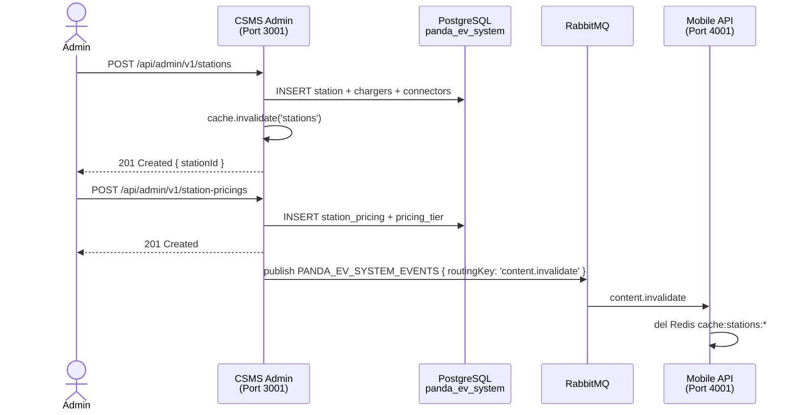
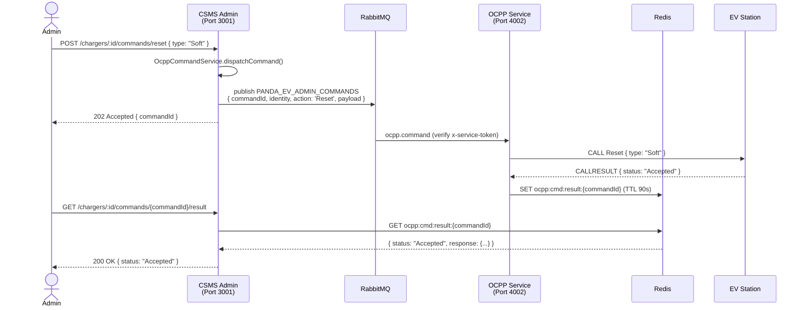
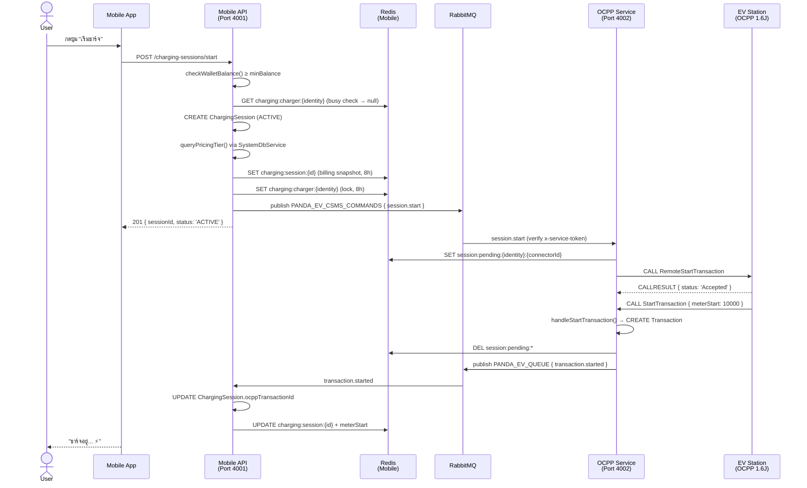
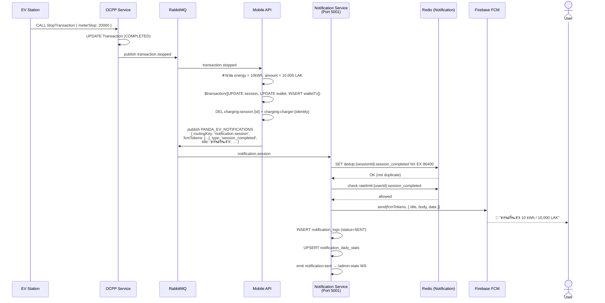
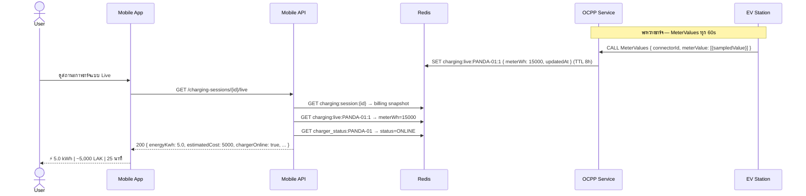
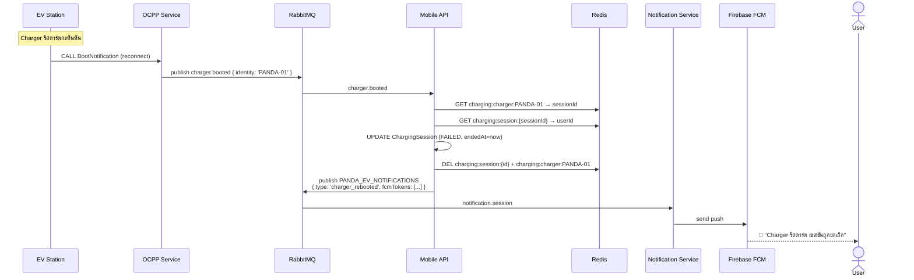
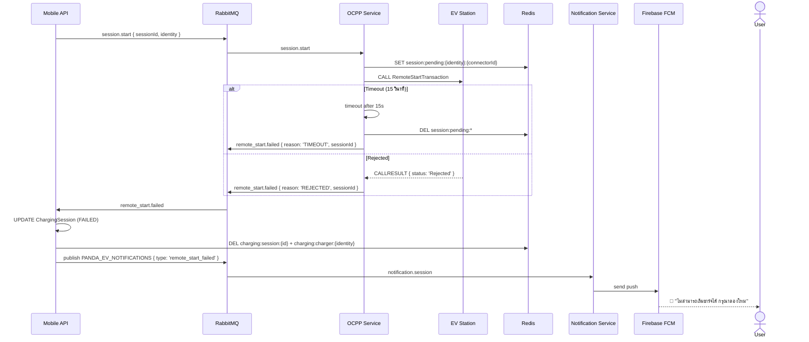

# เอกสารสถาปัตยกรรมระบบบริหารจัดการการชาร์จรถยนต์ไฟฟ้า (EV Charging Management System)

> **Panda EV Platform** — วิเคราะห์สถาปัตยกรรม 4 Microservices
> จัดทำโดย: Claude Code Analysis
> อัปเดตล่าสุด: 2026-03-22

---

## สารบัญ

1. [ภาพรวมสถาปัตยกรรมระบบ](#1-ภาพรวมสถาปัตยกรรมระบบ)
2. [REST API Specification](#2-rest-api-specification)
3. [RabbitMQ Message Queue Architecture](#3-rabbitmq-message-queue-architecture)
4. [WebSocket Communication](#4-websocket-communication)
5. [Data Flow Scenarios](#5-data-flow-scenarios)
6. [Security Implementation](#6-security-implementation)
7. [Performance Optimization](#7-performance-optimization)
8. [Implementation Checklist](#8-implementation-checklist)
9. [OCPP Action — Full Implementation Status](#9-ocpp-action--full-implementation-status)
10. [Deployment บน Google Cloud](#10-deployment-บน-google-cloud)

---

## 1. ภาพรวมสถาปัตยกรรมระบบ

### 1.1 Service Registry

| Service | Port | DB Schema | URL Prefix | วัตถุประสงค์ |
|---|---|---|---|---|
| `panda-ev-csms-system-admin` | 3001 | `panda_ev_system` (29 models) | `/api/admin/v1/` | IAM, CMS, Stations, Pricing, Audit |
| `panda-ev-client-mobile` | 4001 | `panda_ev_core` (13 models) | `/api/mobile/v1/` | Auth, Wallet, Charging Sessions |
| `panda-ev-ocpp` | 4002 | `panda_ev_ocpp` (4 models) | WebSocket only | OCPP 1.6J Charger Protocol Handler |
| `panda-ev-notification` | 5001 | `panda_ev_notifications` (6 models) | `/api/notification/` | FCM Push, Stats Aggregation, Admin WS Dashboard |

### 1.2 Mermaid Diagram — ภาพรวม

```mermaid
graph TB
    subgraph External["🌐 External Clients"]
        WEB["🖥️ Admin Browser\n(React/Vue Dashboard)"]
        MOB["📱 Mobile App\n(iOS / Android)"]
        EV["⚡ EV Charging Station\n(OCPP 1.6J over WebSocket)"]
    end

    subgraph ADMIN["🏢 CSMS Admin Service (Port 3001)\npanda-ev-csms-system-admin"]
        A_REST["REST API\n/api/admin/v1/..."]
        A_WS["Socket.IO Gateway\n/pricing, / (notifications)"]
        A_RMQ_SUB["RabbitMQ Consumer\nPANDA_EV_USER_EVENTS\nmessage.created"]
        A_RMQ_PUB["RabbitMQ Publisher\nPANDA_EV_ADMIN_COMMANDS\nPANDA_EV_SYSTEM_EVENTS"]
        A_DB[("PostgreSQL\npanda_ev_system\n29 Models")]
        A_CACHE[("Redis\nCache + Sessions")]
    end

    subgraph OCPP["⚡ OCPP Service (Port 4002)\npanda-ev-ocpp"]
        O_WS["WebSocket Gateway\nws://host/ocpp/{identity}\nOCPP 1.6J Protocol"]
        O_RMQ_PUB["RabbitMQ Publisher\nPANDA_EV_QUEUE"]
        O_RMQ_SUB["RabbitMQ Consumer\nPANDA_EV_CSMS_COMMANDS\nPANDA_EV_ADMIN_COMMANDS"]
        O_DB[("PostgreSQL\npanda_ev_ocpp\n4 Models")]
        O_CACHE[("Redis\nCharger Status\nSession State\nCommand Results")]
    end

    subgraph MOBILE["📱 Mobile API Service (Port 4001)\npanda-ev-client-mobile"]
        M_REST["REST API\n/api/mobile/v1/..."]
        M_RMQ_PUB["RabbitMQ Publisher\nPANDA_EV_CSMS_COMMANDS\nPANDA_EV_USER_EVENTS\nPANDA_EV_NOTIFICATIONS"]
        M_RMQ_SUB["RabbitMQ Consumer\nPANDA_EV_QUEUE\nPANDA_EV_SYSTEM_EVENTS"]
        M_DB[("PostgreSQL\npanda_ev_core\n13 Models")]
        M_CACHE[("Redis\nBilling Snapshot\nCharger Lock\nParking Timer")]
        M_SYSDB[("SystemDbService\nRead from\npanda_ev_system")]
    end

    subgraph NOTIF["🔔 Notification Service (Port 5001)\npanda-ev-notification"]
        N_RMQ_SUB["RabbitMQ Consumer\nPANDA_EV_NOTIFICATIONS (DLQ)\nPANDA_EV_QUEUE (aggregation)"]
        N_WS["Socket.IO Gateway\n/admin-stats namespace"]
        N_DB[("PostgreSQL\npanda_ev_notifications\n6 Models")]
        N_CACHE[("Redis\nDedup Keys\nRate Limit Windows")]
        N_FCM["Firebase FCM\nSend Push"]
    end

    subgraph INFRA["🛠️ Shared Infrastructure"]
        MQ[("🐰 RabbitMQ\nMessage Broker")]
        REDIS[("🔴 Redis\nShared Cache\ncharger_status:{id}")]
        FCM["🔔 Firebase FCM\nCloud Messaging"]
    end

    %% Admin connections
    WEB -->|HTTPS REST| A_REST
    WEB -->|Socket.IO| A_WS
    WEB -->|Socket.IO /admin-stats| N_WS
    A_REST --- A_DB
    A_REST --- A_CACHE
    A_WS --- A_CACHE
    A_RMQ_SUB --- A_DB

    %% Mobile connections
    MOB -->|HTTPS REST + JWT| M_REST
    M_REST --- M_DB
    M_REST --- M_CACHE
    M_REST --- M_SYSDB

    %% OCPP connections
    EV <-->|WebSocket OCPP 1.6J| O_WS
    O_WS --- O_DB
    O_WS --- O_CACHE

    %% RabbitMQ flows — Mobile ↔ OCPP
    M_RMQ_PUB -->|session.start\nsession.stop| MQ
    MQ -->|PANDA_EV_CSMS_COMMANDS| O_RMQ_SUB
    O_RMQ_PUB -->|transaction.started\ntransaction.stopped\ncharger.booted etc.| MQ
    MQ -->|PANDA_EV_QUEUE| M_RMQ_SUB
    MQ -->|PANDA_EV_QUEUE| N_RMQ_SUB

    %% RabbitMQ flows — Admin ↔ OCPP
    A_RMQ_PUB -->|ocpp.command| MQ
    MQ -->|PANDA_EV_ADMIN_COMMANDS| O_RMQ_SUB

    %% RabbitMQ flows — User sync
    M_RMQ_PUB -->|user.registered| MQ
    MQ -->|PANDA_EV_USER_EVENTS| A_RMQ_SUB

    %% RabbitMQ flows — CMS invalidation
    A_RMQ_PUB -->|content.invalidate| MQ
    MQ -->|PANDA_EV_SYSTEM_EVENTS| M_RMQ_SUB

    %% RabbitMQ flows — Notifications
    M_RMQ_PUB -->|notification.session\nnotification.targeted| MQ
    MQ -->|PANDA_EV_NOTIFICATIONS| N_RMQ_SUB
    N_FCM -->|Push| FCM
    FCM -->|Push| MOB

    %% Redis shared
    O_CACHE -->|charger_status:{identity}| REDIS
    REDIS -->|read live status| A_CACHE
    REDIS -->|read live status| M_CACHE

    %% Admin reads Mobile DB
    M_SYSDB -->|raw pg Pool\nread-only| A_DB

    %% Notification DB
    N_RMQ_SUB --- N_DB
    N_RMQ_SUB --- N_CACHE
    N_WS --- N_DB

    classDef admin fill:#4A90D9,color:#fff,stroke:#2171B5
    classDef ocpp fill:#27AE60,color:#fff,stroke:#1E8449
    classDef mobile fill:#8E44AD,color:#fff,stroke:#6C3483
    classDef notif fill:#E74C3C,color:#fff,stroke:#C0392B
    classDef infra fill:#E67E22,color:#fff,stroke:#D35400
    classDef external fill:#ECF0F1,color:#2C3E50,stroke:#BDC3C7
    class ADMIN admin
    class OCPP ocpp
    class MOBILE mobile
    class NOTIF notif
    class INFRA infra
    class External external
```

### 1.3 Legend — คำอธิบายสัญลักษณ์

| สัญลักษณ์ | ประเภทการสื่อสาร | ลักษณะ |
|---|---|---|
| `─────►` HTTPS REST | Synchronous | Client ส่ง request รอ response ทันที |
| `─ ─ ─►` RabbitMQ | Asynchronous | Publish แล้วไม่รอ, Consumer ประมวลผลแยก |
| `◄────►` WebSocket | Bidirectional Real-time | เชื่อมต่อถาวร ส่งทั้งสองทาง |
| `━━━━►` Redis Shared | Cache/Pub-Sub | Service A เขียน, Service B อ่าน |
| `· · · ►` Raw pg Pool | Cross-DB Read | Mobile อ่านข้อมูล Admin DB โดยตรง |

---

## 2. REST API Specification

> **หมายเหตุ:** การสื่อสารระหว่าง Service ใช้ **RabbitMQ** (async) และ **Redis** (shared state)
> Mobile อ่านข้อมูล Admin ผ่าน **SystemDbService** (raw PostgreSQL pool)

### 2.1 Admin REST API (`/api/admin/v1/`)

#### Station & Charger Management

| Method | Endpoint | วัตถุประสงค์ | Auth |
|---|---|---|---|
| `GET` | `/stations` | รายการสถานีชาร์จทั้งหมด | Bearer + `stations:read` |
| `POST` | `/stations` | สร้างสถานีใหม่ | Bearer + `stations:create` |
| `GET` | `/stations/:id` | รายละเอียดสถานี | Bearer + `stations:read` |
| `PUT` | `/stations/:id` | แก้ไขสถานี | Bearer + `stations:update` |
| `DELETE` | `/stations/:id` | ลบสถานี (soft delete) | Bearer + `stations:delete` |
| `GET` | `/stations/:id/chargers/live` | สถานะ Charger Real-time จาก Redis | Bearer + `chargers:read` |
| `GET` | `/chargers/dashboard` | Dashboard ภาพรวม Charger ทั้งหมด | Bearer + `chargers:read` |

#### OCPP Remote Commands (ใหม่ — 17 endpoints)

| Method | Endpoint | OCPP Action | Auth |
|---|---|---|---|
| `POST` | `/chargers/:id/commands/change-availability` | `ChangeAvailability` | Bearer + `chargers:manage` |
| `POST` | `/chargers/:id/commands/reset` | `Reset` | Bearer + `chargers:manage` |
| `POST` | `/chargers/:id/commands/clear-cache` | `ClearCache` | Bearer + `chargers:manage` |
| `POST` | `/chargers/:id/commands/unlock-connector` | `UnlockConnector` | Bearer + `chargers:manage` |
| `POST` | `/chargers/:id/commands/get-configuration` | `GetConfiguration` | Bearer + `chargers:read` |
| `POST` | `/chargers/:id/commands/change-configuration` | `ChangeConfiguration` | Bearer + `chargers:manage` |
| `POST` | `/chargers/:id/commands/get-diagnostics` | `GetDiagnostics` | Bearer + `chargers:read` |
| `POST` | `/chargers/:id/commands/update-firmware` | `UpdateFirmware` | Bearer + `chargers:manage` |
| `POST` | `/chargers/:id/commands/trigger-message` | `TriggerMessage` | Bearer + `chargers:manage` |
| `POST` | `/chargers/:id/commands/reserve-now` | `ReserveNow` | Bearer + `chargers:manage` |
| `POST` | `/chargers/:id/commands/cancel-reservation` | `CancelReservation` | Bearer + `chargers:manage` |
| `POST` | `/chargers/:id/commands/send-local-list` | `SendLocalList` | Bearer + `chargers:manage` |
| `POST` | `/chargers/:id/commands/get-local-list-version` | `GetLocalListVersion` | Bearer + `chargers:read` |
| `POST` | `/chargers/:id/commands/set-charging-profile` | `SetChargingProfile` | Bearer + `chargers:manage` |
| `POST` | `/chargers/:id/commands/clear-charging-profile` | `ClearChargingProfile` | Bearer + `chargers:manage` |
| `POST` | `/chargers/:id/commands/get-composite-schedule` | `GetCompositeSchedule` | Bearer + `chargers:read` |
| `POST` | `/chargers/:id/commands/data-transfer` | `DataTransfer` | Bearer + `chargers:manage` |
| `GET` | `/chargers/:id/commands/:commandId/result` | Poll ผลลัพธ์คำสั่ง | Bearer + `chargers:read` |

> **Command Flow:** Admin REST → `PANDA_EV_ADMIN_COMMANDS` queue → OCPP Service
> ผลลัพธ์เก็บที่ Redis `ocpp:cmd:result:{commandId}` TTL 90 วินาที

#### IAM, Pricing, Other

| Method | Endpoint | วัตถุประสงค์ | Auth |
|---|---|---|---|
| `POST` | `/auth/login` | เข้าสู่ระบบ Admin | Public |
| `GET` | `/users` | รายการ Admin Users | Bearer + `users:read` |
| `POST` | `/users` | สร้าง Admin User | Bearer + `users:create` |
| `GET` | `/iam/roles` | รายการ Role | Bearer + `roles:read` |
| `GET` | `/pricing-tiers` | รายการ Pricing Tier | Bearer + `pricing-tiers:read` |
| `GET` | `/audit-logs` | ประวัติการดำเนินการ | Bearer + `audit-logs:read` |
| `GET` | `/mobile-users` | รายการ Mobile Users (read-only mirror) | Bearer + `mobile-users:read` |

### 2.2 Mobile REST API (`/api/mobile/v1/`)

| Method | Endpoint | วัตถุประสงค์ | Auth |
|---|---|---|---|
| `POST` | `/auth/register` | สมัครสมาชิก | Public |
| `POST` | `/auth/verify-otp` | ยืนยัน OTP | Public |
| `POST` | `/auth/login` | เข้าสู่ระบบ | Public |
| `GET` | `/stations` | รายการสถานีชาร์จ | Bearer |
| `GET` | `/stations/nearby` | สถานีใกล้เคียง | Bearer |
| `GET` | `/stations/map` | Map pins สำหรับแผนที่ | Bearer |
| `GET` | `/stations/:id` | รายละเอียดสถานี | Bearer |
| `GET` | `/stations/:id/chargers/status` | Live status ของ Charger ทุกตัวในสถานี (ใหม่) | Public |
| `GET` | `/wallet` | ยอดกระเป๋าเงิน | Bearer |
| `POST` | `/wallet/top-up` | เติมเงิน | Bearer |
| `POST` | `/charging-sessions/start` | เริ่มชาร์จ | Bearer |
| `POST` | `/charging-sessions/:id/stop` | หยุดชาร์จ | Bearer |
| `GET` | `/charging-sessions` | ประวัติการชาร์จ | Bearer |
| `GET` | `/charging-sessions/:id/live` | Live status ของ Session ที่กำลังชาร์จ (ใหม่) | Bearer |

> **`GET /charging-sessions/:id/live`** อ่านข้อมูลจาก 3 Redis keys:
> - `charging:session:{id}` — billing snapshot (pricePerKwh, meterStart)
> - `charging:live:{identity}:{connectorId}` — current meterWh จาก MeterValues
> - `charger_status:{identity}` — online/offline status

### 2.3 Notification REST API (`/api/notification/`)

| Method | Endpoint | วัตถุประสงค์ | Auth |
|---|---|---|---|
| `GET` | `/health` | Liveness probe | Public |
| `GET` | `/templates` | รายการ Notification Templates | Bearer |
| `POST` | `/templates` | สร้าง Template | Bearer |
| `GET` | `/logs` | ประวัติการส่ง Notification | Bearer |
| `GET` | `/stats/daily` | สถิติรายวัน (aggregated) | Bearer |
| `GET` | `/stats/hourly/:stationId` | สถิติรายชั่วโมงของสถานี | Bearer |

### 2.4 Response Format มาตรฐาน (ทุก Service)

```json
{
  "success": true,
  "statusCode": 200,
  "data": { "...": "..." },
  "message": "Operation successful",
  "meta": {
    "page": 1,
    "limit": 20,
    "total": 150,
    "totalPages": 8
  },
  "timestamp": "2026-03-22T08:00:00+07:00"
}
```

---

## 3. RabbitMQ Message Queue Architecture

### 3.1 Queue Registry (ครบทุก Queue)

| Queue Name | ผู้ส่ง | ผู้รับ | วัตถุประสงค์ | Security |
|---|---|---|---|---|
| `PANDA_EV_QUEUE` | OCPP | Mobile + Notification | OCPP Events (transaction, charger, connector) | RS256 JWT |
| `PANDA_EV_CSMS_COMMANDS` | Mobile | OCPP | Session Start/Stop Commands | RS256 JWT |
| `PANDA_EV_ADMIN_COMMANDS` | Admin | OCPP | Remote OCPP Commands (Reset, Config ฯลฯ) | RS256 JWT |
| `PANDA_EV_NOTIFICATIONS` | Mobile, Admin | Notification | Push Notification Requests (with DLQ) | RS256 JWT |
| `PANDA_EV_NOTIFICATIONS_DLQ` | Notification (dead-letter) | Monitor/Ops | Failed notifications after 3 retries | — |
| `PANDA_EV_USER_EVENTS` | Mobile | Admin | User Registration Sync | RS256 JWT |
| `PANDA_EV_SYSTEM_EVENTS` | Admin | Mobile | CMS Cache Invalidation | RS256 JWT |
| `message.created` | Chat Service | Admin | Push Notification Trigger | RS256 JWT |

### 3.2 Message Payload Examples

#### `PANDA_EV_CSMS_COMMANDS` — session.start

```json
{
  "routingKey": "session.start",
  "sessionId": "sess-uuid-0001",
  "identity": "PANDA-THATLUANG-01",
  "connectorId": 1,
  "mobileUserId": "user-uuid-0001",
  "idTag": "RFID-TAG-001"
}
```

#### `PANDA_EV_ADMIN_COMMANDS` — ocpp.command (ใหม่)

```json
{
  "routingKey": "ocpp.command",
  "commandId": "cmd-uuid-0001",
  "identity": "PANDA-THATLUANG-01",
  "action": "Reset",
  "payload": { "type": "Soft" }
}
```

> ผลลัพธ์เก็บที่ Redis `ocpp:cmd:result:{commandId}` (TTL 90s):
```json
{
  "commandId": "cmd-uuid-0001",
  "status": "Accepted",
  "response": { "status": "Accepted" },
  "completedAt": "2026-03-22T08:00:05+07:00"
}
```

#### `PANDA_EV_QUEUE` — transaction.started

```json
{
  "routingKey": "transaction.started",
  "sessionId": "sess-uuid-0001",
  "ocppTransactionId": 42,
  "meterStart": 10000,
  "startTime": "2026-03-22T08:00:00+07:00",
  "identity": "PANDA-THATLUANG-01",
  "chargerId": "charger-uuid-0001",
  "connectorId": 1,
  "mobileUserId": "user-uuid-0001"
}
```

#### `PANDA_EV_QUEUE` — transaction.stopped

```json
{
  "routingKey": "transaction.stopped",
  "ocppTransactionId": 42,
  "meterStop": 20000,
  "stopReason": "Remote",
  "stopTime": "2026-03-22T09:30:00+07:00",
  "identity": "PANDA-THATLUANG-01",
  "chargerId": "charger-uuid-0001"
}
```

#### `PANDA_EV_QUEUE` — charger.offline / charger.booted (ใหม่)

```json
{ "routingKey": "charger.offline", "identity": "PANDA-THATLUANG-01", "timestamp": "..." }
{ "routingKey": "charger.booted", "identity": "PANDA-THATLUANG-01", "model": "SGIC-DC-120K", "firmwareVersion": "1.2.3" }
```

#### `PANDA_EV_NOTIFICATIONS` — notification.session (ใหม่)

```json
{
  "routingKey": "notification.session",
  "userId": "user-uuid-0001",
  "sessionId": "sess-uuid-0001",
  "stationId": "station-uuid-0001",
  "chargerIdentity": "PANDA-THATLUANG-01",
  "fcmTokens": ["token-abc...", "token-xyz..."],
  "type": "session_completed",
  "title": "ชาร์จเสร็จแล้ว!",
  "body": "ใช้พลังงาน 10 kWh ค่าบริการ 10,000 LAK",
  "data": { "type": "session_completed", "sessionId": "sess-uuid-0001" },
  "priority": "high"
}
```

#### `PANDA_EV_USER_EVENTS` — user.registered

```json
{
  "routingKey": "user.registered",
  "userId": "mobile-user-uuid-0001",
  "email": "user@example.com",
  "firstName": "ສົມ",
  "lastName": "ໃຈດີ",
  "phoneNumber": "+8562012345678",
  "registeredAt": "2026-03-22T08:00:00+07:00"
}
```

### 3.3 Service-to-Service JWT Header

ทุก RabbitMQ message มี AMQP Header:

```
x-service-token: eyJhbGciOiJSUzI1NiIsInR5cCI6IkpXVCJ9...
```

```json
{
  "iss": "mobile-api",
  "aud": "PANDA_EV_CSMS_COMMANDS",
  "jti": "unique-token-id",
  "iat": 1742624400,
  "exp": 1742624430
}
```

Token ไม่ผ่านการตรวจสอบ → **nack ทิ้ง** (ไม่ requeue)

### 3.4 DLQ Retry Strategy — Notification Service

```
PANDA_EV_NOTIFICATIONS
  └── Handler ล้มเหลว?
        ├── retry 1: delay 5s   → re-publish กลับ queue พร้อม x-retry-count: 1
        ├── retry 2: delay 30s  → re-publish กลับ queue พร้อม x-retry-count: 2
        ├── retry 3: delay 120s → re-publish กลับ queue พร้อม x-retry-count: 3
        └── retry 4+: ack + publish → PANDA_EV_NOTIFICATIONS_DLX → PANDA_EV_NOTIFICATIONS_DLQ
```

---

## 4. WebSocket Communication

### 4.1 WebSocket Gateways ทั้งหมด

| Service | URL / Namespace | Auth | วัตถุประสงค์ |
|---|---|---|---|
| OCPP | `ws://host/ocpp/{identity}` | OCPP Basic Auth (optional) | Charger ↔ CSMS OCPP 1.6J |
| Admin | `Socket.IO /` | Bearer JWT บน `handleConnection` | Admin push notifications |
| Admin | `Socket.IO /pricing` | Bearer JWT | Real-time pricing updates |
| Notification | `Socket.IO /admin-stats` | Bearer JWT | Live session stats + notification events |

### 4.2 Admin Notification Gateway (Port 3001)

| Namespace | Room | Event Emitted | Trigger |
|---|---|---|---|
| `/` | `user:{userId}` | `notification` | Consumer รับ `message.created` |
| `/pricing` | `station:{stationId}` | `pricing:updated` | Pricing tier ถูกแก้ไข |

### 4.3 Notification Admin Stats Gateway (Port 5001 — ใหม่)

| Namespace | Event Emitted | Payload | Trigger |
|---|---|---|---|
| `/admin-stats` | `notification:sent` | `{ type, userId, stationId, chargerIdentity, status, sentAt }` | หลัง FCM send ทุกครั้ง |
| `/admin-stats` | `session:live_update` | `{ routingKey, identity, stationId, event: 'session_started'/'session_completed', ...}` | OCPP transaction events |
| `/admin-stats` | `stats:hourly_updated` | `{ stationId, stationName, hour, sessionsStarted, totalEnergyKwh, ... }` | หลัง aggregation UPSERT |
| `/admin-stats` | `system:alert` | `{ level, message, data }` | Errors / DLQ overflow |

### 4.4 OCPP 1.6J Action — ตารางครบถ้วน

| Action | ทิศทาง | Handler | ผล DB | ผล Redis | RabbitMQ |
|---|---|---|---|---|---|
| `BootNotification` | Station→OCPP | `handleBootNotification()` | Charger.status=ONLINE | `charger_status:{id}` | `charger.booted` |
| `StatusNotification` (id=0) | Station→OCPP | `handleStatusNotification()` | Charger.status | `charger_status:{id}` | `charger.status_changed` |
| `StatusNotification` (id>0) | Station→OCPP | `handleStatusNotification()` | Connector.status | `connector_status:{id}:{conn}` | `connector.status_changed` |
| `Heartbeat` | Station→OCPP | `handleHeartbeat()` | Charger.lastHeartbeat | — | `charger.heartbeat` |
| `Authorize` | Station→OCPP | `handleAuthorize()` | — | reads `session:pending:*` | — |
| `StartTransaction` | Station→OCPP | `handleStartTransaction()` | Transaction(ACTIVE) | del `session:pending:*` | `transaction.started` |
| `StopTransaction` | Station→OCPP | `handleStopTransaction()` | Transaction(COMPLETED) | — | `transaction.stopped` |
| `MeterValues` | Station→OCPP | `handleMeterValues()` | — | `charging:live:{id}:{conn}` (8h) | — |
| `DataTransfer` | Both | `handleDataTransfer()` | OcppLog | — | `charger.data_transfer` |
| `DiagnosticsStatusNotification` | Station→OCPP | `handleDiagnosticsStatus()` | OcppLog | — | `charger.diagnostics_status` |
| `FirmwareStatusNotification` | Station→OCPP | `handleFirmwareStatus()` | OcppLog | — | `charger.firmware_status` |
| `RemoteStartTransaction` | OCPP→Station | `sendRemoteStart()` | — | `session:pending:*` | `remote_start.failed` (ถ้าล้มเหลว) |
| `RemoteStopTransaction` | OCPP→Station | `sendRemoteStop()` | — | — | — |
| `ChangeAvailability` | OCPP→Station | `sendChangeAvailability()` | — | result at `ocpp:cmd:result:*` | — |
| `Reset` | OCPP→Station | `sendReset()` | — | result at `ocpp:cmd:result:*` | — |
| `ClearCache` | OCPP→Station | `sendClearCache()` | — | result at `ocpp:cmd:result:*` | — |
| `UnlockConnector` | OCPP→Station | `sendUnlockConnector()` | — | result at `ocpp:cmd:result:*` | — |
| `GetConfiguration` | OCPP→Station | `sendGetConfiguration()` | — | result at `ocpp:cmd:result:*` | — |
| `ChangeConfiguration` | OCPP→Station | `sendChangeConfiguration()` | — | result at `ocpp:cmd:result:*` | — |
| `GetDiagnostics` | OCPP→Station | `sendGetDiagnostics()` | — | result at `ocpp:cmd:result:*` | — |
| `UpdateFirmware` | OCPP→Station | `sendUpdateFirmware()` | — | result at `ocpp:cmd:result:*` | — |
| `TriggerMessage` | OCPP→Station | `sendTriggerMessage()` | — | result at `ocpp:cmd:result:*` | — |
| `ReserveNow` | OCPP→Station | `sendReserveNow()` | — | result at `ocpp:cmd:result:*` | — |
| `CancelReservation` | OCPP→Station | `sendCancelReservation()` | — | result at `ocpp:cmd:result:*` | — |
| `SendLocalList` | OCPP→Station | `sendLocalList()` | — | result at `ocpp:cmd:result:*` | — |
| `GetLocalListVersion` | OCPP→Station | `sendGetLocalListVersion()` | — | result at `ocpp:cmd:result:*` | — |
| `SetChargingProfile` | OCPP→Station | `sendSetChargingProfile()` | — | result at `ocpp:cmd:result:*` | — |
| `ClearChargingProfile` | OCPP→Station | `sendClearChargingProfile()` | — | result at `ocpp:cmd:result:*` | — |
| `GetCompositeSchedule` | OCPP→Station | `sendGetCompositeSchedule()` | — | result at `ocpp:cmd:result:*` | — |
| Disconnect | — | `handleDisconnection()` | — | `charger_status:{id}=OFFLINE` | `charger.offline` |

### 4.5 Redis Key Reference (ทุก Service)

| Key Pattern | TTL | ผู้เขียน | ผู้อ่าน | วัตถุประสงค์ |
|---|---|---|---|---|
| `charger_status:{identity}` | 600s | OCPP | Admin, Mobile | Charger status สำหรับ Dashboard + Live API |
| `connector_status:{chargerId}:{connectorId}` | 60s | OCPP | OCPP | Connector status cache |
| `session:pending:{identity}:{connectorId}` | 300s | OCPP SessionService | OCPP handleStartTransaction | เชื่อม Mobile session กับ OCPP transaction |
| `charging:live:{identity}:{connectorId}` | 8h | OCPP | Mobile | Live meter readings (Wh) จาก MeterValues |
| `ocpp:cmd:result:{commandId}` | 90s | OCPP AdminCommandService | Admin REST (poll) | ผลลัพธ์คำสั่ง Remote OCPP |
| `charger:apikey:{identity}` | — | Admin | OCPP | Auth API key สำหรับ Charger |
| `charging:session:{sessionId}` | 8h | Mobile | Mobile OcppConsumer | Billing snapshot (pricePerKwh, fees config) |
| `charging:charger:{identity}` | 8h | Mobile | Mobile | Lock ป้องกัน double-start |
| `parking:timer:{identity}:{connectorId}` | 8h | Mobile | Mobile | Parking fee timer state |
| `refresh:{userId}:{tokenId}` | 7d | Admin/Mobile | Admin/Mobile | Refresh token tracking |
| `svc:jti:{jti}` | 60s | ServiceJwtService | ServiceJwtService | Anti-replay blacklist |
| `cache:{resource}:{md5(params)}` | Varies | All Services | All Services | Query result cache |
| `dedup:{sessionId}:{type}` | 24h | Notification | Notification | ป้องกันการส่ง notification ซ้ำ |
| `ratelimit:{userId}:{type}:{window}` | Window-based | Notification | Notification | Sliding window rate limit |

---

## 5. Data Flow Scenarios

### 5.1 Scenario 1: Admin สร้างสถานีชาร์จใหม่



### 5.2 Scenario 2: Admin ส่งคำสั่ง OCPP Remote (ใหม่)



### 5.3 Scenario 3: User เริ่มชาร์จ (Full Flow)



### 5.4 Scenario 4: ชาร์จเสร็จ + Notification Service (ใหม่)



### 5.5 Scenario 5: Live Charging Status (ใหม่)



### 5.6 Scenario 6: Charger เปิดใหม่ (Booted) ระหว่างชาร์จ (ใหม่)



### 5.7 Scenario 7: Remote Start ล้มเหลว



---

## 6. Security Implementation

### 6.1 Service-to-Service JWT (RS256)

```typescript
// ServiceJwtService — ทุก Service ใช้ร่วมกัน
class ServiceJwtService {
  sign(audience: string): string | null {
    // RS256 private key → JWT
    // payload: { iss, aud, jti, iat, exp: now+30s }
  }

  async verify(token: string): Promise<Payload | null> {
    // 1. Parse JWT header.payload.signature
    // 2. ตรวจสอบ iss มีใน trustedKeys
    // 3. ตรวจสอบ signature ด้วย RSA public key
    // 4. ตรวจสอบ exp (ไม่เกิน 30 วินาที)
    // 5. ตรวจสอบ jti ใน Redis blacklist (ป้องกัน replay attack)
    // 6. บันทึก jti ลง Redis (TTL 60s)
  }
}
```

**Trust Matrix (อัปเดตรวม Notification Service):**

| Service | ออก Token เป็น | เชื่อ Token จาก |
|---|---|---|
| `admin-api` | `admin-api` | `mobile-api`, `ocpp-csms`, `notification-service` |
| `mobile-api` | `mobile-api` | `admin-api`, `ocpp-csms`, `notification-service` |
| `ocpp-csms` | `ocpp-csms` | `mobile-api`, `admin-api` |
| `notification-service` | `notification-service` | `mobile-api`, `admin-api` |

**Key Distribution (generate-service-keys-local.sh):**

```
keys/ directory ของแต่ละ Service:
  admin/keys/        → admin.pem, admin.pub, mobile.pub, ocpp.pub, notification.pub
  mobile/keys/       → mobile.pem, mobile.pub, admin.pub, ocpp.pub, notification.pub
  ocpp/keys/         → ocpp.pem, ocpp.pub, admin.pub, mobile.pub
  notification/keys/ → notification.pem, notification.pub, admin.pub, mobile.pub
```

### 6.2 User JWT Authentication

```
Admin Service:
  RS256 (JWT_PRIVATE_KEY + JWT_PUBLIC_KEY) หรือ HS256 fallback (JWT_SECRET)
  Access Token: 15 นาที
  Refresh Token: 7 วัน (เก็บใน Redis refresh:{userId}:{tokenId})

Mobile Service:
  RS256 หรือ HS256 fallback
  Access Token: 15 นาที
  Refresh Token: 30 วัน
```

### 6.3 RBAC — Admin Service

```
Permission format: {resource}:{action}
ตัวอย่าง: stations:read, chargers:manage, pricing-tiers:update

Roles:
  super-admin  → ทุก Permission (90)
  admin        → 80 Permission (ยกเว้น roles:*, permissions:*)
  viewer       → 18 Permission (read-only เท่านั้น)

OCPP Commands ใช้ Permission:
  chargers:read   → GET config, list version, composite schedule
  chargers:manage → Reset, ChangeAvailability, UpdateFirmware ฯลฯ
```

### 6.4 Notification Deduplication + Rate Limiting

```typescript
// DedupService — ป้องกัน notification ซ้ำ
await redis.set(`dedup:${sessionId}:${type}`, '1', 'EX', 86400, 'NX');
// คืน null = ซ้ำ (suppress), 'OK' = ใหม่ (ส่งได้)

// RateLimitService — sliding window
// ป้องกัน spam notification ต่อ user ต่อประเภท
```

### 6.5 Soft Delete

```typescript
// ทุก Service — ไม่ลบข้อมูลจริง
await prisma.resource.update({
  where: { id },
  data: { deletedAt: new Date(), updatedById: userId }
});
// ทุก query กรอง deletedAt: null
```

---

## 7. Performance Optimization

### 7.1 Redis Caching Strategy

| Resource | TTL | Cache Key | Invalidation |
|---|---|---|---|
| Station list | 2-5 min | `cache:stations:{md5(query)}` | On mutation |
| Station detail | 2-5 min | `cache:station:{id}` | On update |
| Pricing tiers | 5 min | `cache:pricing-tiers:{md5(query)}` | On mutation |
| CMS content | 30 min | `content:{slug}` | Via RabbitMQ event |
| App config | 5 min | `app:config:{key}` | On update |
| Charger live status | 600s | `charger_status:{identity}` | OCPP เขียนใหม่เสมอ |
| Live meter values | 8h | `charging:live:{id}:{conn}` | MeterValues event |
| OCPP command result | 90s | `ocpp:cmd:result:{commandId}` | Auto-expire |
| Notification dedup | 24h | `dedup:{sessionId}:{type}` | Auto-expire |

### 7.2 Pre-Aggregated Statistics (Notification Service)

Notification Service ใช้ **No Raw Query Rule** — ไม่มีการ SELECT COUNT/SUM จาก transaction tables:

```sql
-- UPSERT อัตโนมัติทุกครั้งที่มี event — ไม่มี full table scan
INSERT INTO panda_ev_notifications.station_hourly_stats
  (id, station_id, station_name, hour, sessions_started)
VALUES (gen_random_uuid(), $1, $2, $3, 1)
ON CONFLICT (station_id, hour) DO UPDATE
  SET sessions_started = station_hourly_stats.sessions_started + 1;
```

Tables ที่ Aggregate:
- `station_hourly_stats` — sessions, energy, revenue ต่อชั่วโมงต่อสถานี
- `station_daily_stats` — สรุปรายวันต่อสถานี (avg session, peak concurrent, overstay)
- `notification_daily_stats` — funnel delivery metrics ต่อ type+channel ต่อวัน

### 7.3 Database Index Recommendations

```sql
-- OCPP Service
CREATE INDEX idx_transaction_ocpp_id ON "panda_ev_ocpp"."transactions"(ocpp_transaction_id);
CREATE INDEX idx_transaction_charger ON "panda_ev_ocpp"."transactions"(charger_id, status);

-- Mobile Service
CREATE INDEX idx_charging_session_user ON "panda_ev_core"."charging_sessions"(user_id, status);
CREATE INDEX idx_charging_session_ocpp ON "panda_ev_core"."charging_sessions"(ocpp_transaction_id);
CREATE INDEX idx_wallet_tx_user ON "panda_ev_core"."wallet_transactions"(user_id, created_at DESC);

-- Admin Service
CREATE INDEX idx_charger_identity ON "panda_ev_system"."chargers"(ocpp_identity) WHERE deleted_at IS NULL;
CREATE INDEX idx_station_pricing ON "panda_ev_system"."station_pricings"(station_id, is_active, priority DESC);

-- Notification Service (defined in Prisma schema)
-- notification_logs: (user_id, sent_at), (station_id, sent_at), (status, sent_at)
-- station_hourly_stats: (station_id, hour) UNIQUE
-- station_daily_stats: (station_id, date) UNIQUE
-- notification_daily_stats: (date, type, channel) UNIQUE
```

### 7.4 Fire-and-Forget Pattern

```typescript
// ✅ ถูกต้อง — ไม่บล็อก response
this.systemDb.syncUser(user).catch(() => null);
this.fcm.sendToUser(userId, msg).catch(() => null);
this.auditLog.create({ action }).catch(e => this.logger.error(e));
this.rabbitMQ.publish(QUEUE, msg).catch(() => null);

// ❌ ผิด — บล็อก response
await this.systemDb.syncUser(user);
```

---

## 8. Implementation Checklist

### Priority 1: Critical ✅ ครบแล้ว

- [x] OCPP 1.6J WebSocket Gateway (BootNotification, Heartbeat, Status, Start/Stop Transaction)
- [x] Remote Start/Stop Transaction (await response 15s timeout)
- [x] Wallet deduction atomic transaction (Prisma `$transaction`)
- [x] Redis billing snapshot (8h TTL)
- [x] RabbitMQ service-to-service JWT authentication (RS256)
- [x] Session FAILED on `remote_start.failed` → Notification via RabbitMQ
- [x] Admin RBAC (roles, permissions, groups)
- [x] Mobile auth (register → OTP → login → refresh → logout)
- [x] Soft delete everywhere

### Priority 2: High ✅ ครบแล้ว

- [x] Parking fee timer (Redis) + overstay billing
- [x] Unplug fee deduction
- [x] Pricing tier LATERAL JOIN query (highest priority active tier)
- [x] SystemDbService cross-DB reads (Mobile reads Admin DB)
- [x] Charger live status via Redis (Admin Dashboard)
- [x] CMS content cache invalidation via RabbitMQ
- [x] Dead Letter Queue (DLQ) สำหรับ `PANDA_EV_NOTIFICATIONS` (3 retries, exponential backoff)
- [x] OCPP Authorize action handler
- [x] GetConfiguration / ChangeConfiguration
- [x] OCPP Admin Command Bridge (Admin → OCPP via `PANDA_EV_ADMIN_COMMANDS`)
- [x] Notification Microservice (FCM delivery, dedup, rate-limit, aggregation, WS dashboard)
- [x] Live charging session API (`GET /charging-sessions/:id/live`)
- [x] Live charger status per station (`GET /stations/:id/chargers/status`)
- [x] `charger.offline` + `charger.booted` OCPP event handlers in Mobile

### Priority 3: Medium ✅ ครบแล้ว

- [x] OCPP ChangeAvailability
- [x] OCPP Reset (Soft/Hard)
- [x] OCPP UnlockConnector
- [x] OCPP GetDiagnostics / UpdateFirmware
- [x] OCPP ReserveNow / CancelReservation
- [x] OCPP SetChargingProfile / ClearChargingProfile / GetCompositeSchedule
- [x] OCPP TriggerMessage
- [x] OCPP DataTransfer
- [x] OCPP SendLocalList / GetLocalListVersion
- [ ] Prometheus metrics endpoint
- [ ] Distributed tracing (OpenTelemetry)
- [ ] Circuit breaker สำหรับ SystemDbService calls

### Priority 4: Nice to Have

- [ ] OCPP 2.0.1 support (ISO 15118, Plug & Charge)
- [ ] Smart charging scheduler (LoadManagement)
- [ ] Multi-tenancy support
- [ ] Real-time Mobile WebSocket (แทน FCM polling)
- [ ] GraphQL API สำหรับ Admin Dashboard
- [ ] Notification delivery webhook (DELIVERED status จาก FCM)
- [ ] Promotional discount engine

---

## 9. OCPP Action — Full Implementation Status

### 9.1 Station → CSMS (Inbound)

| Action | Status | Handler | หมายเหตุ |
|---|---|---|---|
| `BootNotification` | ✅ Done | `handleBootNotification()` | |
| `StatusNotification` | ✅ Done | `handleStatusNotification()` | connectorId=0 และ >0 |
| `Heartbeat` | ✅ Done | `handleHeartbeat()` | |
| `Authorize` | ✅ Done | `handleAuthorize()` | ตรวจสอบ idTag vs pending session |
| `StartTransaction` | ✅ Done | `handleStartTransaction()` | links pending session |
| `StopTransaction` | ✅ Done | `handleStopTransaction()` | |
| `MeterValues` | ✅ Done | `handleMeterValues()` | normalise kWh → Wh |
| `DataTransfer` | ✅ Done | `handleDataTransfer()` | bidirectional |
| `DiagnosticsStatusNotification` | ✅ Done | `handleDiagnosticsStatus()` | |
| `FirmwareStatusNotification` | ✅ Done | `handleFirmwareStatus()` | |

### 9.2 CSMS → Station (Outbound)

| Action | Status | Method | Trigger |
|---|---|---|---|
| `RemoteStartTransaction` | ✅ Done | `sendRemoteStart()` | Mobile session.start |
| `RemoteStopTransaction` | ✅ Done | `sendRemoteStop()` | Mobile session.stop |
| `ChangeAvailability` | ✅ Done | `sendChangeAvailability()` | Admin command |
| `Reset` | ✅ Done | `sendReset()` | Admin command |
| `ClearCache` | ✅ Done | `sendClearCache()` | Admin command |
| `UnlockConnector` | ✅ Done | `sendUnlockConnector()` | Admin command |
| `GetConfiguration` | ✅ Done | `sendGetConfiguration()` | Admin command |
| `ChangeConfiguration` | ✅ Done | `sendChangeConfiguration()` | Admin command |
| `GetDiagnostics` | ✅ Done | `sendGetDiagnostics()` | Admin command |
| `UpdateFirmware` | ✅ Done | `sendUpdateFirmware()` | Admin command |
| `TriggerMessage` | ✅ Done | `sendTriggerMessage()` | Admin command |
| `ReserveNow` | ✅ Done | `sendReserveNow()` | Admin command |
| `CancelReservation` | ✅ Done | `sendCancelReservation()` | Admin command |
| `SendLocalList` | ✅ Done | `sendLocalList()` | Admin command |
| `GetLocalListVersion` | ✅ Done | `sendGetLocalListVersion()` | Admin command |
| `SetChargingProfile` | ✅ Done | `sendSetChargingProfile()` | Admin command |
| `ClearChargingProfile` | ✅ Done | `sendClearChargingProfile()` | Admin command |
| `GetCompositeSchedule` | ✅ Done | `sendGetCompositeSchedule()` | Admin command |
| `DataTransfer` | ✅ Done | via gateway | Admin command |

### 9.3 สรุป

> **OCPP 1.6J Implementation: 27/27 Actions ✅ สมบูรณ์**
>
> Inbound handlers: 10 actions
> Outbound commands: 19 actions (2 session-initiated + 17 admin-initiated)

---

## 10. Deployment บน Google Cloud

### 10.1 Architecture Diagram

```
Google Cloud Platform
├── GKE (Google Kubernetes Engine)
│   ├── Namespace: panda-ev
│   │   ├── Deployment: admin-service        (3 replicas, Port 3001)
│   │   ├── Deployment: mobile-service       (3 replicas, Port 4001)
│   │   ├── Deployment: ocpp-service         (2 replicas + sticky session, Port 4002)
│   │   ├── Deployment: notification-service (2 replicas, Port 5001)
│   │   └── Deployment: api-key-service      (1 replica)
│   └── Services + Ingress (HTTPS termination + WSS for OCPP)
├── Cloud SQL (PostgreSQL)
│   ├── DB: panda_ev_system   (Admin)
│   ├── DB: panda_ev_core     (Mobile)
│   ├── DB: panda_ev_ocpp     (OCPP)
│   └── DB: panda_ev_notifications (Notification)
├── Memorystore (Redis)
│   └── Instance: panda-ev-redis (Private IP, shared across services)
├── Cloud AMQP / Managed RabbitMQ
│   └── Queues: PANDA_EV_QUEUE, PANDA_EV_CSMS_COMMANDS,
│               PANDA_EV_ADMIN_COMMANDS, PANDA_EV_NOTIFICATIONS,
│               PANDA_EV_NOTIFICATIONS_DLQ, PANDA_EV_USER_EVENTS,
│               PANDA_EV_SYSTEM_EVENTS
├── Firebase Cloud Messaging
│   └── Project: pandaev-bd994
└── Secret Manager
    ├── JWT Private/Public Keys (RS256) per service
    ├── Service JWT Keys (RS256 inter-service)
    ├── Firebase Service Account JSON
    └── Database credentials
```

### 10.2 Kubernetes Secrets

```bash
# Notification Service
kubectl create secret generic panda-notification-secrets \
  --from-literal=DATABASE_URL="postgresql://..." \
  --from-literal=REDIS_URL="redis://..." \
  --from-literal=RABBITMQ_URL="amqp://..." \
  --from-literal=SERVICE_NAME="notification-service" \
  --from-literal=SERVICE_JWT_PRIVATE_KEY="$(base64 < keys/notification.pem | tr -d '\n')" \
  --from-literal=TRUSTED_SERVICE_PUBLIC_KEYS='[{"iss":"mobile-api","key":"..."},{"iss":"admin-api","key":"..."}]' \
  --from-literal=FIREBASE_PROJECT_ID="pandaev-bd994" \
  --from-literal=FIREBASE_CLIENT_EMAIL="firebase-adminsdk@..." \
  --from-literal=FIREBASE_PRIVATE_KEY="..." \
  --dry-run=client -o yaml | kubectl apply -f -
```

### 10.3 OCPP WebSocket — Sticky Session

```yaml
# OCPP Service ต้องการ Sticky Session เพราะ Charger เชื่อมต่อ WebSocket ถาวร
apiVersion: v1
kind: Service
metadata:
  name: ocpp-service
  annotations:
    cloud.google.com/backend-config: '{"default": "ocpp-backend-config"}'
spec:
  sessionAffinity: ClientIP
  sessionAffinityConfig:
    clientIP:
      timeoutSeconds: 86400
```

### 10.4 Monitoring และ Alerting

```
Metrics ที่ควร Monitor:
  OCPP:         จำนวน Charger Online/Offline, WebSocket connection count
  Mobile:       Charging sessions active, wallet transaction rate
  Notification: Queue depth (PANDA_EV_NOTIFICATIONS), DLQ count, FCM success rate
  Redis:        Memory usage, key expiry rate
  All services: 5xx error rate, P95 latency

Alerts:
  - Charger offline > 10 นาที → Slack notification
  - PANDA_EV_NOTIFICATIONS_DLQ count > 0 → PagerDuty (notification failed permanently)
  - Redis memory > 80% → Scale up Memorystore
  - DB connection pool exhausted → Emergency alert
  - FCM send success rate < 90% → Firebase quota check
```

---

## สรุปสถาปัตยกรรม

| หัวข้อ | สถานะปัจจุบัน | หมายเหตุ |
|---|---|---|
| OCPP 1.6J Actions | ✅ **27/27 สมบูรณ์** | Inbound 10 + Outbound 19 |
| Admin OCPP Commands | ✅ **17 commands** | ผ่าน `PANDA_EV_ADMIN_COMMANDS` queue |
| Notification Microservice | ✅ **พร้อมใช้งาน** | FCM, DLQ retry, dedup, aggregation, WS dashboard |
| Service Communication | ✅ RabbitMQ + Redis + JWT | 6 queues, RS256 inter-service auth |
| Billing | ✅ Energy + Unplug + Parking | Atomic wallet deduction |
| Live Data APIs | ✅ Session live + Charger status | 2 new REST endpoints ใน Mobile |
| Pre-aggregated Stats | ✅ | Hourly + Daily per station + Notification funnel |
| Security | ✅ RS256 JWT ทุก service | 4-service trust matrix |
| Monitoring | ⏳ ยังไม่มี | Prometheus + Grafana เป็น next step |
| OCPP Smart Charging | ✅ SetChargingProfile | ยังไม่มี scheduler |

---

*เอกสารนี้สร้างจากการวิเคราะห์ Source Code จริง ณ วันที่ 2026-03-22*
*อ้างอิง: panda-ev-ocpp · panda-ev-csms-system-admin · panda-ev-client-mobile · panda-ev-notification*
